# ⛰️🐍 Example HPC Alpine Python Project

```mermaid
flowchart LR
    subgraph repo["📦 This repo"]
        direction LR
        run_script["📄 Run script"]
        subgraph conda_env["&nbsp;🌐 Anaconda environment &nbsp;"]
            python_code["📄 Python code"]
        end

    end
    subgraph alpine["🖥️ Alpine"]
        subgraph spacer1[" "]
            subgraph spacer2["⚙️⚙️⚙️"]
            end
        end
    end

    repo --> | process on | alpine

style conda_env fill:#FEF3C7,stroke:#D97706;
style repo fill:#ffffff,stroke:#444444;
style alpine fill:#ffffff,stroke:#444444;
style spacer1 fill:#ffffff,stroke:#ffffff;
style spacer2 fill:#ffffff,stroke:#ffffff;
```

_Diagram showing this repository's work as being processed on Alpine._

This repository is intended to help demonstrate the use of Python on [Alpine](https://curc.readthedocs.io/en/latest/clusters/alpine/index.html), a [High Performance Compute (HPC) cluster](https://en.wikipedia.org/wiki/High-performance_computing) hosted by the [University of Colorado Boulder's Research Computing](https://www.colorado.edu/rc/).
We use Python here by way of [Anaconda](https://conda.io/projects/conda/en/latest/user-guide/tasks/manage-environments.html) environment management to run code on Alpine.

> __ℹ️ Please reference this work alongside a the following related blog post:__
> [Tip of the Week: Using Python and Anaconda with the Alpine HPC Cluster](https://cu-dbmi.github.io/set-website/2023/07/07/Using-Python-and-Anaconda-with-the-Alpine-HPC-Cluster.html)

Content here was developed by the [Software Engineering Team (SET)](https://cu-dbmi.github.io/set-website/) in the [Department of Biomedical Informatics (DBMI)](https://medschool.cuanschutz.edu/dbmi) with the [University of Colorado Anschutz School of Medicine](https://medschool.cuanschutz.edu/).
