# ⛰️🐍 Example HPC Alpine Python Project

This repo demonstrates the use of Python on [Alpine](https://curc.readthedocs.io/en/latest/clusters/alpine/index.html), a [High Performance Compute (HPC) cluster](https://en.wikipedia.org/wiki/High-performance_computing) hosted by the [University of Colorado Boulder's Research Computing](https://www.colorado.edu/rc/).
We use Python by way of [Anaconda](https://conda.io/projects/conda/en/latest/user-guide/tasks/manage-environments.html) environment management to run code on Alpine.

## Table of Contents

1. [__Backround:__](#background) here we cover the background of Alpine and related technologies.
1. [__Implementation:__](#implementation) in this section we use the contents of this repository on Alpine.

## Background

### Why would I use Alpine?

```mermaid
flowchart LR
    subgraph alpine["fa:fa-server Alpine"]
        direction TB
        subgraph resources[" &nbsp; 💪 Compute Resources &nbsp;"]
            check_1["fa:fa-check"]
        end
        subgraph time[" &nbsp; 🕑 Long-running Jobs &nbsp;"]
            check_2["fa:fa-check"]
        end
        subgraph collaborations[" &nbsp; 👥 Collaborations &nbsp;"]
            check_3["fa:fa-check"]
        end
    end

style alpine fill:#ffffff,stroke:#444444;
style check_1 fill:#D1FAE5,stroke:#D1FAE5;
style check_2 fill:#D1FAE5,stroke:#D1FAE5;
style check_3 fill:#D1FAE5,stroke:#D1FAE5;
style alpine fill:#ffffff,stroke:#444444;
```

Alpine is a [High Performance Compute (HPC) cluster](https://en.wikipedia.org/wiki/High-performance_computing).
HPC environments provide shared computer hardware resources like [memory](https://en.wikipedia.org/wiki/Computer_memory), [CPU](https://en.wikipedia.org/wiki/Central_processing_unit), [GPU](https://en.wikipedia.org/wiki/Graphics_processing_unit) or others to run performance-intensive work.
Reasons for using Alpine might include:

- __Compute resources:__ Leveraging otherwise cost-prohibitive amounts of memory, CPU, GPU, etc. for processing data.
- __Long-running jobs:__ Completing long-running processes which may take hours or days to complete.
- __Collaborations:__ Sharing a single implementation environment for reproducibility within a group (avoiding "works on my machine").

### How does Alpine work?

Alpine's compute resources are managed through compute nodes in a system called [Slurm](https://github.com/SchedMD/slurm). Slurm helps coordinate shared and configurable access to the compute resources.

> ℹ️ __Wait, what are "nodes"?__
> A simplified way to understand the architecture of Slurm on Alpine is through login and compute "nodes" (computers).
Login nodes act as a way to prepare and submit processes which will be completed on compute nodes.
Login nodes have limited resource access and are not recommended for running procedures.

One can interact with Slurm on Alpine by use of [Slurm interfaces and directives](https://curc.readthedocs.io/en/latest/clusters/alpine/examples.html).
A quick way of accessing Alpine resources is through the use of the `acompile` command, which references a script with common Slurm configurations.
One can also access Slurm directly through [various commands](https://slurm.schedmd.com/quickstart.html#commands) on Alpine.

Many common software packages are available through the [Modules package](https://github.com/cea-hpc/modules) on Alpine ([UCB RC documentation: The Modules System](https://curc.readthedocs.io/en/latest/compute/modules.html)).

### How does Slurm work?

Using Alpine effectively involves knowing how to leverage Slurm.
A simplified way to understand how Slurm works is through the following sequence.
Please note that some steps and additional complexity are obscured for the purposes of providing a basis of understanding.

1. __Create a job script:__ build a script which will configure and run procedures related to the work you seek to accomplish on the HPC cluster.
1. __Submit job to Slurm:__ ask Slurm to run a set of commands or procedures.
1. __Job queue:__ Slurm will queue the submitted job alongside others (recall that the HPC cluster is a shared resource), providing information about progress as time goes on.
1. __Job processing:__ Slurm will run the procedures in the job script as scheduled.
1. __Job completion or cancellation:__ submitted jobs eventually may reach completion or cancellation states with saved information inside Slurm regarding what happened.

## Implementation

This section will cover how Alpine may be used with this repository to run example Python code.
Generally, we'll cover this in two primary steps:[0. Gain Alpine access](#0-gain-alpine-access), [1. preparation](#1-preparation) and [2. implementation](#2-implementation).

### 0. Gain Alpine access

First you will need to gain access to Alpine.
This access is provided to members of the University of Colorado Anschutz through [RMACC](https://rmacc.org/) and is separate from other credentials which may be provided by default in your role.
Please see the following guide from the University of Colorado Boulder's Research Computing covering requesting access and generally how this works for members of the University of Colorado Anschutz.

- __RMACC Access to Alpine:__ [https://curc.readthedocs.io/en/latest/access/rmacc.html](https://curc.readthedocs.io/en/latest/access/rmacc.html)

### 1. Prepare code

Next we need to prepare our code within Alpine.
We do this to balance the fact that we may develop and source control code outside of Alpine and needing to periodically synchronize it with updates.
In the case of this example work, we assume git as an interface for Github as the source control host.

Below you'll find the general steps associated with this process.

### 2. Implement code
