# ⛰️🐍 Example HPC Alpine Python Project

```mermaid
flowchart LR
    subgraph repo["📦 This repo"]
        direction LR
        run_script["📄 Run script"]
        subgraph conda_env["&nbsp;🌐 Anaconda environment &nbsp;"]
            python_code["📄 Python code"]
        end
        
    end
    subgraph alpine["🖥️ Alpine"]
        subgraph spacer1[" "]
            subgraph spacer2["⚙️⚙️⚙️"]
            end
        end
    end

    repo --> | process on | alpine


style conda_env fill:#FEF3C7,stroke:#D97706;
style repo fill:#ffffff,stroke:#444444;
style alpine fill:#ffffff,stroke:#444444;
style spacer1 fill:#ffffff,stroke:#ffffff;
style spacer2 fill:#ffffff,stroke:#ffffff;
```

_Diagram showing this repository's work as being processed on Alpine._

This repository is intended to help demonstrate the use of Python on [Alpine](https://curc.readthedocs.io/en/latest/clusters/alpine/index.html), a [High Performance Compute (HPC) cluster](https://en.wikipedia.org/wiki/High-performance_computing) hosted by the [University of Colorado Boulder's Research Computing](https://www.colorado.edu/rc/).
We use Python here by way of [Anaconda](https://conda.io/projects/conda/en/latest/user-guide/tasks/manage-environments.html) environment management to run code on Alpine.
This readme will cover a background on the technologies and how to use the contents of this repository as though it were a project you were working on and wanting to run on Alpine.

## Table of Contents

1. [__Backround:__](#background) here we cover the background of Alpine and related technologies.
1. [__Implementation:__](#implementation) in this section we use the contents of this repository on Alpine.

## Background

### Why would I use Alpine?

```mermaid
flowchart LR
    subgraph alpine["🖥️ Alpine"]
        direction TB
        subgraph resources[" &nbsp; 💪 Compute Resources &nbsp;"]
            check_1["✅"]
        end
        subgraph time[" &nbsp; 🕑 Long-running Jobs &nbsp;"]
            check_2["✅"]
        end
        subgraph collaborations[" &nbsp; 👥 Collaborations &nbsp;"]
            check_3["✅"]
        end
    end

style alpine fill:#ffffff,stroke:#444444;
style check_1 fill:#D1FAE5,stroke:#D1FAE5;
style check_2 fill:#D1FAE5,stroke:#D1FAE5;
style check_3 fill:#D1FAE5,stroke:#D1FAE5;
style alpine fill:#ffffff,stroke:#444444;
```

_Diagram showing common benefits of Alpine and HPC clusters._

Alpine is a [High Performance Compute (HPC) cluster](https://en.wikipedia.org/wiki/High-performance_computing).
HPC environments provide shared computer hardware resources like [memory](https://en.wikipedia.org/wiki/Computer_memory), [CPU](https://en.wikipedia.org/wiki/Central_processing_unit), [GPU](https://en.wikipedia.org/wiki/Graphics_processing_unit) or others to run performance-intensive work.
Reasons for using Alpine might include:

- __Compute resources:__ Leveraging otherwise cost-prohibitive amounts of memory, CPU, GPU, etc. for processing data.
- __Long-running jobs:__ Completing long-running processes which may take hours or days to complete.
- __Collaborations:__ Sharing a single implementation environment for reproducibility within a group (avoiding "works on my machine").

### How does Alpine work?

```mermaid
flowchart LR
    users["👥 Users"]
    subgraph alpine["🖥️ Alpine"]
        slurm["🗓️ Slurm"]
        subgraph login_nodes["🔑 Login node(s)"]
            acompile["📄 acompile"]
            slurm_cmd["⌨️ Slurm cmd's"]
        end
        subgraph compute_nodes["⚙️ Compute node(s)"]
            hardware["⚙️ Compute\nResources"]
            modules["💿 Software via\nmodules pkg"]
        end
        
        subgraph storage["📂 Storage"]
            local_storage["📁 Local Storage\n(sometimes temporary)"]
        end
    end
    remote_storage["📁 External Storage\n(user specified / configured)"]

    users --> | preconfigured\nSlurm access| acompile --> slurm
    users --> | direct access | slurm_cmd --> slurm
    slurm --> |"schedules\n(shared) use of"| hardware
    slurm --> | provides\naccess to| modules --> | which may\n leverage| hardware
    hardware --> | may deliver\nresults to| local_storage
    hardware --> | or deliver\nresults to| remote_storage

style alpine fill:#ffffff,stroke:#444444;
style slurm fill:#F0F9FF,stroke:#075985;
```

_Diagram showing high-level user workflow and Alpine components._

Alpine's compute resources are used through compute nodes in a system called [Slurm](https://github.com/SchedMD/slurm).
Slurm helps coordinate shared and configurable access to the compute resources.
Data for or from Slurm work may be stored temporarily on local storage or on user-specific external (remote) storage.

> ℹ️ __Wait, what are "nodes"?__
>
> A simplified way to understand the architecture of Slurm on Alpine is through login and compute "nodes" (computers).
Login nodes act as a way to prepare and submit processes which will be completed on compute nodes.
Login nodes have limited resource access and are not recommended for running procedures.

One can interact with Slurm on Alpine by use of [Slurm interfaces and directives](https://curc.readthedocs.io/en/latest/clusters/alpine/examples.html).
A quick way of accessing Alpine resources is through the use of the `acompile` command, which references a script with common Slurm configurations.
One can also access Slurm directly through [various commands](https://slurm.schedmd.com/quickstart.html#commands) on Alpine.

Many common software packages are available through the [Modules package](https://github.com/cea-hpc/modules) on Alpine ([UCB RC documentation: The Modules System](https://curc.readthedocs.io/en/latest/compute/modules.html)).

### How does Slurm work?

```mermaid
flowchart LR
    subgraph alpine["🖥️ Alpine"]
        direction LR
        script["📄 Job script"]
        subgraph slurm["🗓️ Slurm"]
            queue["🕑 Queue"]
            processing["⚙️ Processing"]
            completion["✅ Completion\n(or cancellation)"]
        end
    end

    script --> | Submit job\nto Slurm | queue
    queue --> | Scheduled job\nis processed | processing
    processing --> | Processing\ncompletes | completion
    queue --> | Cancellation without\nprocessing| completion

style alpine fill:#ffffff,stroke:#444444;
style slurm fill:#F0F9FF,stroke:#075985;
```

_Diagram showing how Slurm generally works._

Using Alpine effectively involves knowing how to leverage Slurm.
A simplified way to understand how Slurm works is through the following sequence.
Please note that some steps and additional complexity are obscured for the purposes of providing a basis of understanding.

1. __Create a job script:__ build a script which will configure and run procedures related to the work you seek to accomplish on the HPC cluster.
1. __Submit job to Slurm:__ ask Slurm to run a set of commands or procedures.
1. __Job queue:__ Slurm will queue the submitted job alongside others (recall that the HPC cluster is a shared resource), providing information about progress as time goes on.
1. __Job processing:__ Slurm will run the procedures in the job script as scheduled.
1. __Job completion or cancellation:__ submitted jobs eventually may reach completion or cancellation states with saved information inside Slurm regarding what happened.

### How do I store data on Alpine?

```mermaid
flowchart LR
    users["👥 Users"]
    subgraph alpine["🖥️ Alpine"]
        slurm["🗓️ Slurm"]
        process_jobs["Processed jobs"]
        subgraph storage["📂 Storage"]
            local_storage["📁 Local Storage\n(sometimes temporary)"]
        end
    end
    remote_storage["📁 External Storage\n(user specified / configured)"]

    users --> | run their\nwork with | slurm
    slurm --> | runs code| process_jobs
    process_jobs --> | may deliver\nresults to| local_storage
    process_jobs --> | or deliver\nresults to| remote_storage

style alpine fill:#ffffff,stroke:#444444;
style slurm fill:#F0F9FF,stroke:#075985;
```

Data used or produced by your processed jobs on Alpine may use a number of different data storage locations.
Be sure to follow [the Acceptable data storage and use policies of Alpine](https://curc.readthedocs.io/en/latest/additional-resources/policies.html#acceptable-data-storage-and-use), avoiding the use of certain sensitive information and other items.
These may be distinguished in two ways:

1. __Alpine local storage (sometimes temporary):__ Alpine provides a number of temporary data storage locations for accomplishing your work.
⚠️ _Note: some of these locations may be periodically purged and are not a suitable location for long-term data hosting ([see here for more information](https://curc.readthedocs.io/en/latest/additional-resources/policies.html#scratch-file-purge))!_ 
Storage locations available ([see this link for full descriptions](https://curc.readthedocs.io/en/latest/compute/filesystems.html)):

    - __Home filesystem:__ 2 GB of backed up space under `/home/$USER` (where `$USER` is your RMACC or Alpine username).
    - __Projects filesystem:__ 250 GB of backed up space under `/projects/$USER` (where `$USER` is your RMACC or Alpine username).
    - __Scratch filesystem:__ 10 TB (10,240 GB) of space __*which is not backed up*__ under `/scratch/alpine/$USER` (where `$USER` is your RMACC or Alpine username).

2. __External / remote storage:__ Users are encouraged to explore external data storage options for long-term hosting. 
Examples may include the following:

    - __[Petalibrary](https://www.colorado.edu/rc/resources/petalibrary)__: subsidized external storage host from University of Colorado Boulder's Research Computing (requires specific arrangements outside of Alpine).
    - __Cloud hosting:__ [object storage](https://en.wikipedia.org/wiki/Object_storage) and related data hosting options from cloud providers like [Microsoft Azure](https://azure.microsoft.com/en-us), [Google Cloud](https://cloud.google.com/) ([internal CU Anschutz GC information](https://www.cuanschutz.edu/offices/office-of-information-technology/tools-services/google-cloud-platform)), or [Amazon Web Services](https://aws.amazon.com/).
    - __Others:__ additional options include third-party "storage as a service" offerings like Google Drive or Dropbox and/or external servers maintained by other groups.

### How do I send or receive data on Alpine?

```mermaid
flowchart LR
    external_storage["📁 External Storage\n(user specified / configured)"]
    subgraph alpine["🖥️ Alpine"]
        subgraph storage["📂 Storage"]
            local_storage["📁 Local Storage\n(sometimes temporary)"]
        end
    end
    
    external_storage --> | send data\nto Alpine | local_storage
    local_storage --> | receive data\nfrom Alpine | external_storage

style alpine fill:#ffffff,stroke:#444444;
```

_Diagram showing external data storage being used to send or receive data on Alpine local storage._

Data may be sent to or gathered from Alpine using a number of different methods.
These may vary contingent on the external data storage being referenced, the code involved, or your group's available resources.
Please reference the following documentation from the University of Colorado Boulder's Research Computing regarding data transfers.

- __The Compute Environment - Data Transfer:__ [https://curc.readthedocs.io/en/latest/compute/data-transfer.html](https://curc.readthedocs.io/en/latest/compute/data-transfer.html)

## Implementation

```mermaid
flowchart LR
    users["(0. Gain access)\n👥 CU Anschutz\nUsers"]
    subgraph alpine["🖥️ Alpine"]
        direction LR
        alpine_terminal1["(1. Prepare code)\n⌨️ git clone"]
        alpine_terminal2["(2. Implement code)\n⌨️ Process run script"]
        subgraph repo["📦 This repo"]
            direction TB
            run_script["📄 Run script"]
            subgraph conda_env["&nbsp;🌐 Anaconda environment &nbsp;"]
                python_code["📄 Python code"]
            end
        end
        subgraph slurm_job["🗓️ Slurm processing"]
            direction LR
            processing["⚙️ Processing"]
        end
        subgraph storage["📂 Storage"]
            local_storage["(3. Gather data)\n📁 Local Storage\n(sometimes temporary)"]
        end
    end

    users --> | gain access\nvia RMACC acct.| alpine_terminal1
    alpine_terminal1 --> | bring repo\n contents to Alpine | repo
    run_script --> |run\nscript file| alpine_terminal2
    alpine_terminal2 --> |submit\nSlurm job| processing
    processing --> | completed job\n sends data to| local_storage
    python_code -.-> | run python code\nwithin conda env |processing

style conda_env fill:#FEF3C7,stroke:#D97706;
style repo fill:#ffffff,stroke:#444444;
style alpine fill:#ffffff,stroke:#444444;
style users fill:#D1FAE5,stroke:#444444;
style alpine_terminal1 fill:#D1FAE5,stroke:#444444;
style alpine_terminal2 fill:#D1FAE5,stroke:#444444;
style local_storage fill:#D1FAE5,stroke:#444444;
```

_Diagram showing how this repository may be used within Alpine through primary steps and processing workflow._

This section will cover how Alpine may be used with this repository to run example Python code.
Generally, we'll cover this in two primary steps: [0. Gain Alpine access](#0-gain-alpine-access), [1. preparation](#1-preparation) and [2. implementation](#2-implementation).

### 0. 🔑 Gain Alpine access

First you will need to gain access to Alpine.
This access is provided to members of the University of Colorado Anschutz through [RMACC](https://rmacc.org/) and is separate from other credentials which may be provided by default in your role.
Please see the following guide from the University of Colorado Boulder's Research Computing covering requesting access and generally how this works for members of the University of Colorado Anschutz.

- __RMACC Access to Alpine:__ [https://curc.readthedocs.io/en/latest/access/rmacc.html](https://curc.readthedocs.io/en/latest/access/rmacc.html)

### 1. 🛠️ Prepare code on Alpine

Next we need to prepare our code within Alpine.
We do this to balance the fact that we may develop and source control code outside of Alpine and needing to periodically synchronize it with updates.
In the case of this example work, we assume git as an interface for Github as the source control host.

Below you'll find the general steps associated with this process.

1. Login to the Alpine command line ([reference this guide](https://curc.readthedocs.io/en/latest/access/rmacc.html#logging-in-to-open-ondemand)).
1. Change directory into the __Projects filesystem__ (generally we'll assume processed data produced by this code are large enough to warrant the need for additional space):  `cd /projects/$USER`
1. Use `git` (built into Alpine by default) commands to clone this repo:  `git clone https://github.com/CU-DBMI/example-hpc-alpine-python`
1. Verify the contents were received as desired (this should show the contents of this repository):  `ls -l example-hpc-alpine-python`

<!--- anchor for referencing github authentication guidance directly --->

> ℹ️ __What if I need to authenticate with Github?__
>
> There are times where you may need to authenticate with Github in order to accomplish your work.
From a Github perspective, you will want to use either Github Personal Access Tokens (PAT) (recommended by Github) or SSH keys associated with the `git` client on Alpine.
Note: if you are prompted for a username and password from `git` when accessing a Github resource, the password is now associated with other keys like PAT's instead of your user's password ([reference](https://github.blog/changelog/2021-08-12-git-password-authentication-is-shutting-down)).
See the following guide from Github for more information on how authentication through `git` to Github works:
>
> - __Github - Authenticating with GitHub from Git:__ [https://docs.github.com/en/get-started/quickstart/set-up-git#authenticating-with-github-from-git](https://docs.github.com/en/get-started/quickstart/set-up-git#authenticating-with-github-from-git)

### 2. ⚙️ Implement code on Alpine

After our code is available on Alpine we're ready to run it using Slurm and related resources.

### 2. 📂 Gather data results
