# ⛰️🐍 Example HPC Alpine Python Project

This repo demonstrates the use of Python on [Alpine](https://curc.readthedocs.io/en/latest/clusters/alpine/index.html), a [High Performance Compute (HPC) cluster](https://en.wikipedia.org/wiki/High-performance_computing) hosted by the [University of Colorado Boulder's Research Computing](https://www.colorado.edu/rc/).
We use Python by way of [Anaconda](https://conda.io/projects/conda/en/latest/user-guide/tasks/manage-environments.html) environment management to run code on Alpine.

## Background

### Why would I use Alpine?

```mermaid
flowchart LR
    subgraph alpine["fa:fa-server Alpine"]
        direction TB
        subgraph resources[" &nbsp; 💪 Compute Resources &nbsp;"]
            check_1["fa:fa-check"]
        end
        subgraph time[" &nbsp; 🕑 Long-running Jobs &nbsp;"]
            check_2["fa:fa-check"]
        end
        subgraph collaborations[" &nbsp; 👥 Collaborations &nbsp;"]
            check_3["fa:fa-check"]
        end
    end

style alpine fill:#ffffff,stroke:#444444;
style check_1 fill:#D1FAE5,stroke:#D1FAE5;
style check_2 fill:#D1FAE5,stroke:#D1FAE5;
style check_3 fill:#D1FAE5,stroke:#D1FAE5;
style alpine fill:#ffffff,stroke:#444444;
```

Alpine is a [High Performance Compute (HPC) cluster](https://en.wikipedia.org/wiki/High-performance_computing).
HPC environments provide shared computer hardware resources like [memory](https://en.wikipedia.org/wiki/Computer_memory), [CPU](https://en.wikipedia.org/wiki/Central_processing_unit), [GPU](https://en.wikipedia.org/wiki/Graphics_processing_unit) or others to run performance-intensive work.
Reasons for using Alpine might include:

- __Compute resources:__ Leveraging otherwise cost-prohibitive amounts of memory, CPU, GPU, etc. for processing data.
- __Long-running jobs:__ Completing long-running processes which may take hours or days to complete.
- __Collaborations:__ Sharing a single implementation environment for reproducibility within a group (avoiding "works on my machine").

### How does Alpine work?

Alpine's compute resources are managed through compute nodes in a system called [Slurm](https://github.com/SchedMD/slurm). Slurm helps coordinate shared and configurable access to the compute resources.

> ℹ️ __Wait, what are "nodes"?__
> A simplified way to understand the architecture of Slurm on Alpine is through login and compute "nodes" (computers).
Login nodes act as a way to prepare and submit processes which will be completed on compute nodes.
Login nodes have limited resource access and are not recommended for running procedures.

One can interact with Slurm on Alpine by use of [Slurm interfaces and directives](https://curc.readthedocs.io/en/latest/clusters/alpine/examples.html).
A quick way of accessing Alpine resources is through the use of the `acompile` command, which references a script with common Slurm configurations.
One can also access Slurm directly through [various commands](https://slurm.schedmd.com/quickstart.html#commands) on Alpine.

Many common software packages are available through the [Modules package](https://github.com/cea-hpc/modules) on Alpine ([UCB RC documentation: The Modules System](https://curc.readthedocs.io/en/latest/compute/modules.html)).

### How does Slurm work?

Using Alpine effectively involves knowing how to use Slurm.
